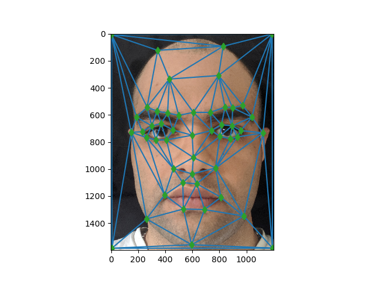
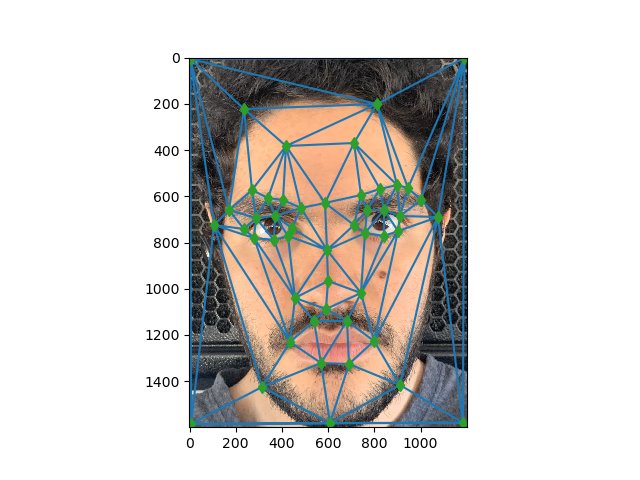

# Face morphing computer-vision

This is simple classical application of affain matrix. For this project I simply use affain matrix to morph one face to another over 45 frames. 

#####I did't include all of my code in the MD file just something to explain what is what.


## The procedures:
- Get some points from each image. Use Delaunay fucntion to create the triangles trangulation 
- Computing the "Mid-way Face"
- The Morph Sequence

### Get some points:
The basic Idea is to define pairs of corresponding points on the two images.Now you can use some library to do that for you I just wanted to do it with hand and curse myself afterwards. The simplest way is probably to use the cpselect (matlab) tool or write your own little tool using ginput (python) and Use Delaunay fucntion to create the triangles trangulation. The best approach would probably be to compute the triangulation at midway shape (i.e. mean of the two point sets) to lessen the potential triangle deformations.

```python
def getpoints(image,filename, points_array):
    plt.imshow(image)
    
    i = 1
    while True:
        x , y = plt.ginput(1, timeout = -1, mouse_add = 1)[0]
        points_array.append([x, y])
        plt.scatter(x, y)
        plt.draw()
        plt.text(x, y,i)
        i+=1
        if (i == 49):
            plt.savefig(filename + '_points.png')
            break
    plt.close()


# print(p)

def trangulation(points_data_1, points_data_2):
	image_trangle_1 = Delaunay(np.array(points_data_1))
	image_trangle_2 = Delaunay(np.array(points_data_2))

	return image_trangle_1, image_trangle_2
```



###Computing the "Mid-way Face"
 1. Computing the average shape (the average of each keypoint location in the two faces.)
 2. Warping both faces into that shape.
 3. Averaging the colors together

I used computeAffine to computer the affain matrix so I could apply it to all the pixles and morph the image to the avrage point.
#### Also I used polygon to get all the pixel coordinates inside each triangle. instead of doing a nested for loop we don't want O(n^2) time complexity!!!!   
``` python 
 def computeAffine(tri1_pts, tri2_pts):
	# transformation matrix
	matrix_t = []

	m = np.zeros( (6, 6) )
	m[0][2], m[1][5], m[2][2], m[3][5], m[4][2], m[5][5] = 1, 1, 1, 1, 1, 1


	
	#element by element we find the right transformation rows and cols
	for tri_1, tri_2 in zip(tri1_pts, tri2_pts):
		m[0][0], m[0][1], m[1][3], m[1][4] = tri_1[0][0], tri_1[0][1],	tri_1[0][0], tri_1[0][1]
		m[2][0], m[2][1], m[3][3], m[3][4] = tri_1[1][0], tri_1[1][1],	tri_1[1][0], tri_1[1][1]
		m[4][0], m[4][1], m[5][3], m[5][4] = tri_1[2][0], tri_1[2][1],	tri_1[2][0], tri_1[2][1]
		vector = np.array([tri_2[0][0], tri_2[0][1], tri_2[1][0], tri_2[1][1], tri_2[2][0], tri_2[2][1]])

		matrix_t.append(np.vstack((np.reshape(np.linalg.lstsq(m, vector.T)[0],(2,3)), [0, 0, 1])))
	
	return matrix_t


	def findmidface(image, points_1,points_2, weight):
	trasnition = np.zeros(image.shape)
	points_1 = np.array(points_1)
	points_2 = np.array(points_2)
	mid_shape = np.around(((1 - weight) * points_1) + (weight * points_2))
	mid_tri = Delaunay(mid_shape)
	
	del_obj_1, del_obj_2 = trangulation(points_1, points_2)
	oip_1 = points_1[mid_tri.simplices].copy()
	dip_1 = mid_shape[mid_tri.simplices].copy()
	m_1 = computeAffine(oip_1, dip_1)
	for orig, dest, solution in zip(oip_1, dip_1, m_1):
		mask = np.zeros(image.shape)
		dest = dest.T
		row, col = polygon(np.clip(dest[1].astype(int),0,image.shape[0]), np.clip(dest[0].astype(int),0,image.shape[1]))
		mask[row.astype(int),col.astype(int)] = 1
		y, x = np.where(mask[:,:,0])
		ones = np.ones(y.shape)
		tran_points = np.vstack([x, y, ones]).astype(int)
		rgb = np.dot(np.linalg.inv(solution),tran_points).astype(int)
		rgb[1] = np.clip(rgb[1],0,image.shape[0])
		rgb[0] = np.clip(rgb[0],0,image.shape[1])
		trasnition[tran_points[1], tran_points[0],:] = image[rgb[1], rgb[0],:]
	return trasnition

```


### Averaging the colors together


